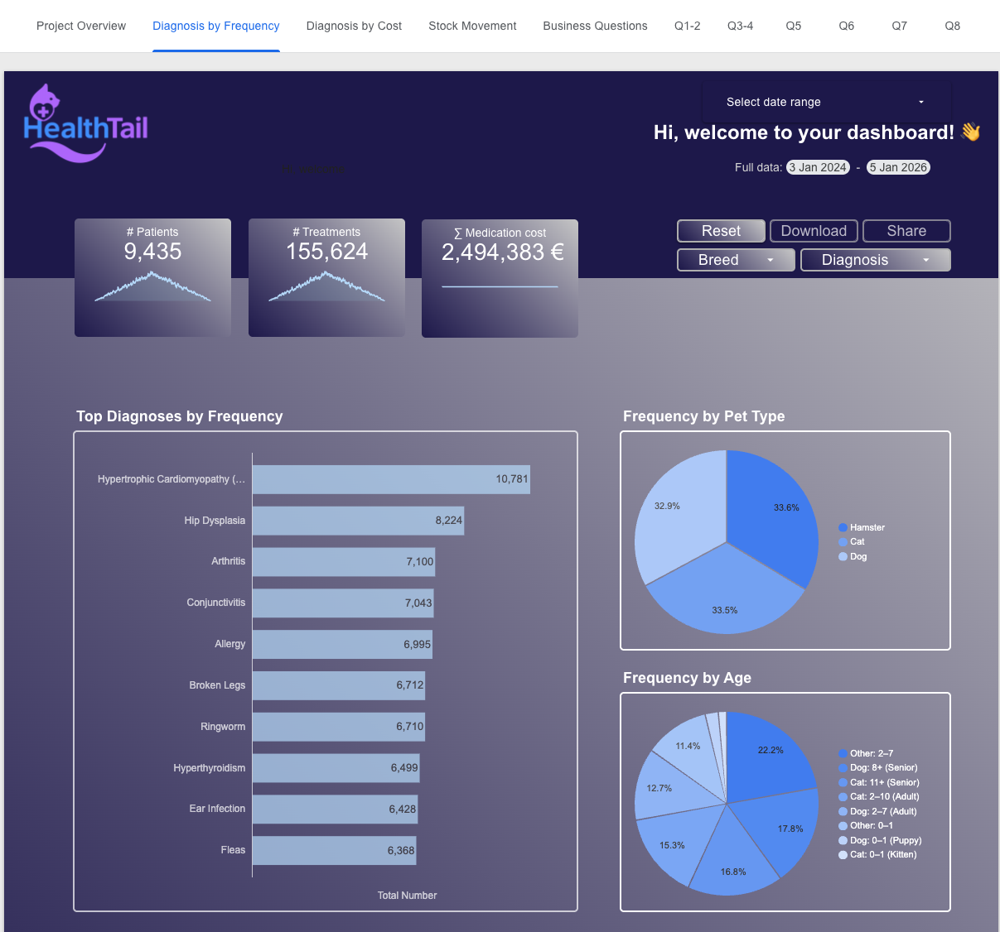
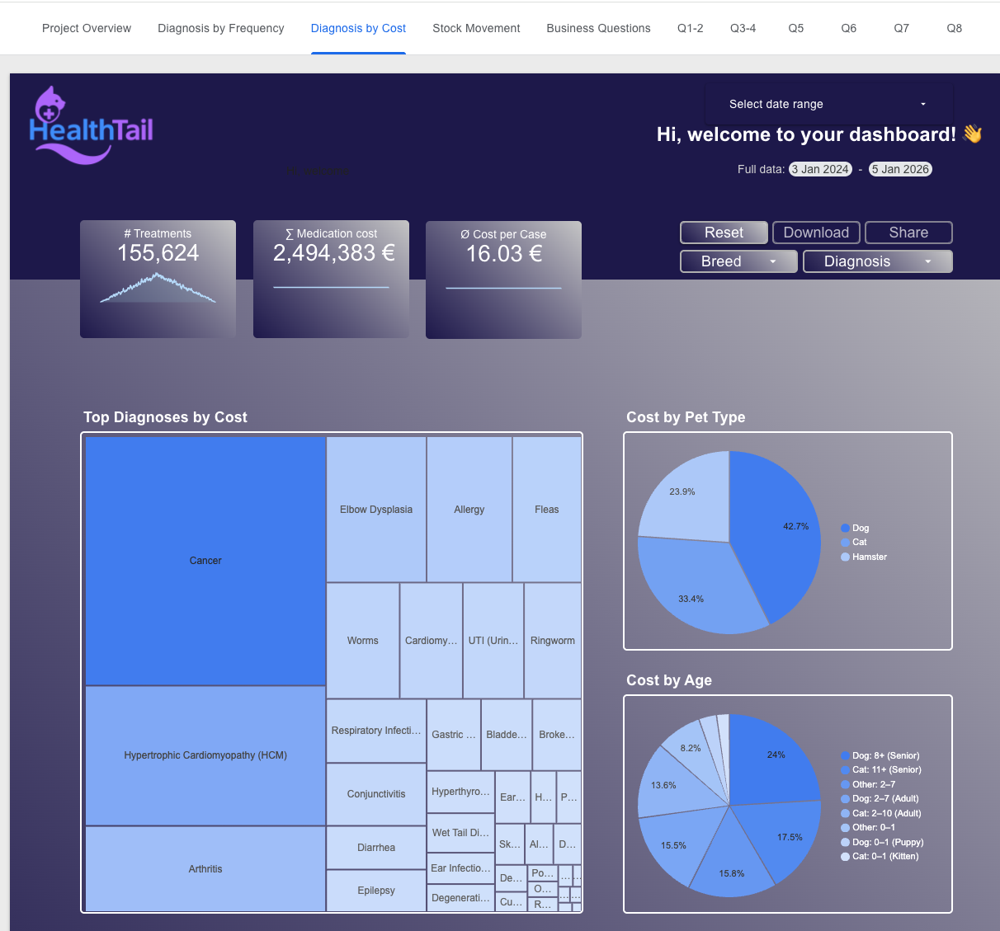
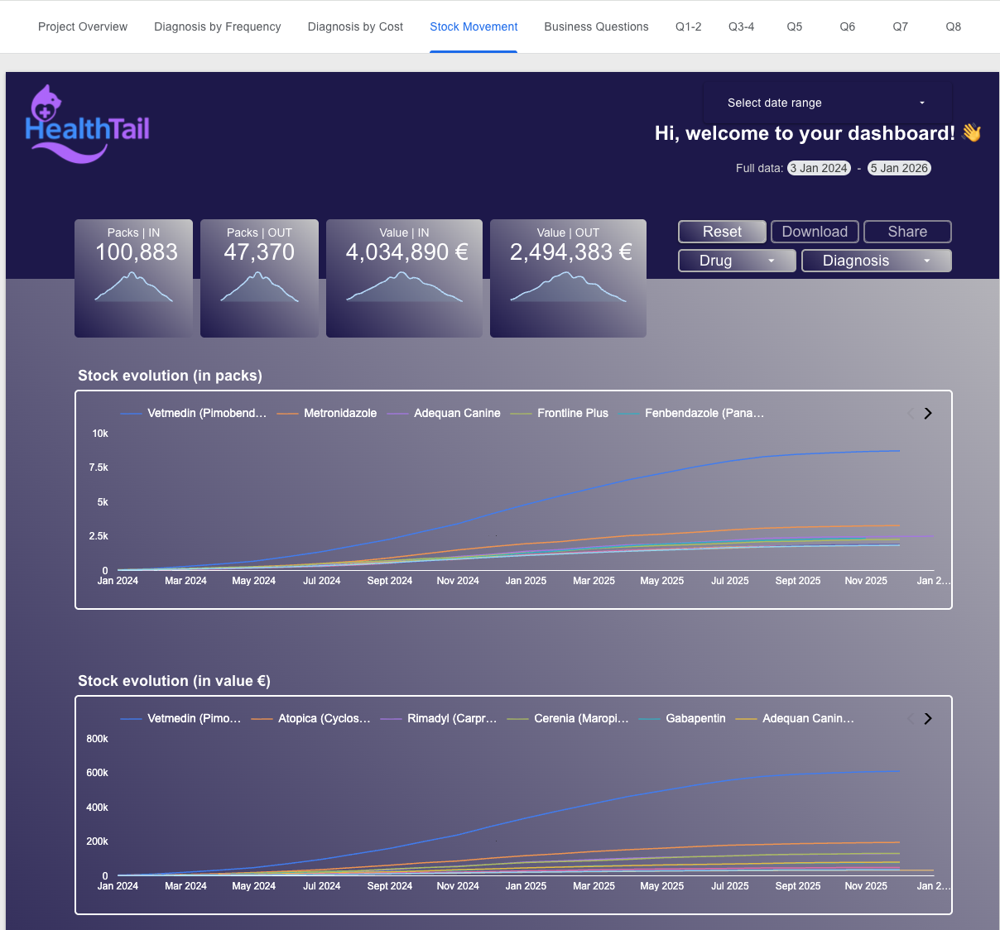

# HealthTail – Diagnoses & Medication Audit


A business-focused BI project for **HealthTail**, a major veterinary hospital.  
This case study automates medication auditing, analyzes disease trends, and delivers a modern analytics dashboard using **BigQuery**, **SQL**, and **Looker Studio**.

---

## 🧭 Executive Summary

HealthTail provided three raw datasets (patient records, visits, and medication invoices).  
The goal was to build an end-to-end BI workflow that:

- cleans and standardizes registration and visit data  
- produces a **monthly medication audit** (stock in/out, usage & value)  
- creates analysis-ready consumer tables in BigQuery  
- answers **two question packages**:  
  - **MAQ1–4** → Medication Audit Questions (SQL results)  
  - **SBQ1–8** → Stakeholder Business Questions (dashboard-driven)  
- develops an interactive Looker Studio dashboard for trends, costs, diagnoses & inventory

The result is a streamlined, scalable BI solution that enables HealthTail to make data-driven decisions in procurement, medical planning, and budgeting.

---

## 💼 Business Context

HealthTail struggled with:

- manual, error-prone medication auditing  
- poor visibility of **diagnosis frequency & cost drivers**  
- no split by **pet type, breed, or age group**  
- no operational view on **inventory buildup** and capital binding  

This BI solution provides the missing analytical foundation.

---

## 📊 Dashboard Preview (Looker Studio)

<!-- markdownlint-disable MD033 -->
### Diagnosis by Frequency



### Diagnosis by Cost



### Stock Movement (In/Out, Cumulative Inventory)


<!-- markdownlint-enable MD033 -->

### 🔗 Live Dashboard

👉 **[Open in Looker Studio](https://lookerstudio.google.com/s/oWTydFfl2W4)**

---

## 🔍 Key Insights (Business-Level)

- **Cancer & HCM** are the highest-cost diagnoses.  
- **Senior pets** contribute the largest share of treatment cost.  
- **Vetmedin (Pimobendan) is massively overstocked** → ~€607k inventory in Dec 2025.  
- **No strong seasonal effects detected**; deeper seasonality analysis is a future opportunity.  
- **Dogs show the highest cost per case**, while cats and hamsters have similar case volumes but lower cost intensity.

---

## ❓ Questions Covered

HealthTail defined *two* distinct question sets:  
one operational (SQL audit) and one strategic (dashboard insights).

### **➤ Medication Audit Questions (MAQ1–4)**

Operational questions answered 100% in SQL using `med_audit`.

Topics include:

- Highest-spend medications  
- Month with most packs consumed  
- Medication × month highest spend combinations  
- Average monthly usage of top medication  

---

### **➤ Stakeholder Business Questions (SBQ1–8)**

Answered through the Looker Studio dashboard.

Topics include:

- Most common diagnoses  
- Cost drivers  
- Breakdown by species & age  
- Trends in diagnosis shares  
- Medication inventory patterns  

---

📄 Full questions → **[docs/ASSIGNMENT_BRIEF.md](docs/ASSIGNMENT_BRIEF.md)**  
📘 Full answers → **[docs/FINDINGS_AND_QA.md](docs/FINDINGS_AND_QA.md)**

---

## 🧭 Project Approach

1. Load CSVs (patients, visits, invoices) into BigQuery  
2. Clean patient/owner data → `registration_clean`  
3. Build **med_audit** (stock in/out consolidation)  
4. Answer **MAQ1–4** via SQL  
5. Create consumer marts (`healthtail_facts`, `healthtail_diag_share`, `med_inventory_all`, `med_diagnosis_map`)  
6. Build Looker Studio dashboard  
7. Answer **SBQ1–8** using dashboard visualizations

Full technical workflow →  
➡️ **[docs/TECHNICAL_README.md](docs/TECHNICAL_README.md)**

---

## 📂 Repository Structure

```text
/sql                    ← All project SQL files
/docs
   ASSIGNMENT_BRIEF.md  ← Summary of assignment & two question packages (MAQ + SBQ)
   TECHNICAL_README.md  ← Detailed ETL + modelling documentation
   FINDINGS_AND_QA.md   ← Answers to stakeholder questions (MAQ + SBQ)
/img                    ← Dashboard screenshots
/dashboard              ← Looker Studio link (looker_studio_link.txt)
README.md               ← Executive summary (this file)
```

### Linked Documentation

- Technical ETL & Modelling → [docs/TECHNICAL_README.md](docs/TECHNICAL_README.md)  
- Findings & Q&A → [docs/FINDINGS_AND_QA.md](docs/FINDINGS_AND_QA.md)  
- Assignment Brief → [docs/ASSIGNMENT_BRIEF.md](docs/ASSIGNMENT_BRIEF.md)

---

## 👤 Author

**Thomas Jortzig**  
HealthTail-Project – September 2025
