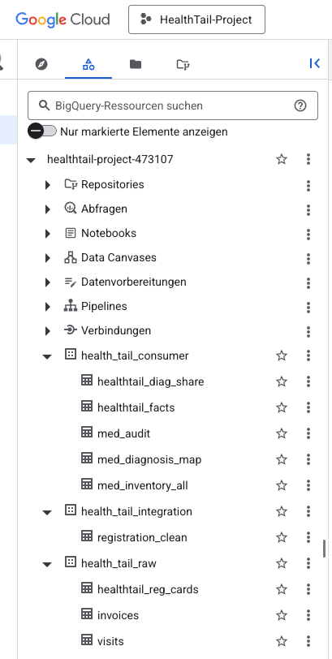
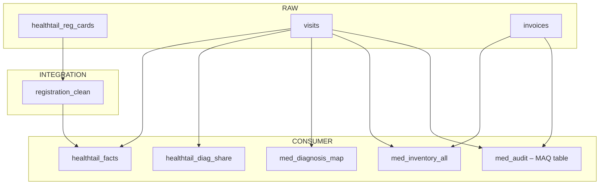

# Technical Documentation – HealthTail Diagnoses & Medication Audit

This technical documentation explains the end-to-end BigQuery pipeline used to transform raw veterinary clinic data into analytics-ready tables consumed by the Looker Studio dashboard.

---

## 1. BigQuery Data Model (Master Overview)

The project follows a three-layer architecture:

```text
RAW → INTEGRATION → CONSUMER → Looker Studio Dashboard
```

### 1.0 BigQuery Project Structure

The following screenshot shows the corresponding data set and table structure in BigQuery.



### 1.1 RAW Layer (source data)

| Raw Table                | Description                                  |
|--------------------------|----------------------------------------------|
| `healthtail_reg_cards`   | patient & owner registration data            |
| `visits`                 | diagnoses, treatments, medication usage      |
| `invoices`               | medication purchases (packs, price, date)    |

---

### 1.2 INTEGRATION Layer (cleaned tables)

| Integration Table        | Description                                      |
|--------------------------|--------------------------------------------------|
| `registration_clean`     | cleaned & standardized patient/owner data        |

Created by:  
[`Step1_integration_registration_clean.sql`](../sql/Step1_integration_registration_clean.sql)

---

### 1.3 CONSUMER Layer (analytics-ready marts)

| Consumer Table            | Description                                                                 |
|---------------------------|-----------------------------------------------------------------------------|
| `med_audit`               | consolidated inflow/outflow of medications (answers MAQs)               |
| `healthtail_facts`        | main fact table (visits × registration_clean)                               |
| `healthtail_diag_share`   | monthly diagnosis counts + % of total                                       |
| `med_inventory_all`       | extended inventory model (flows + running totals)                            |
| `med_diagnosis_map`       | medication → diagnosis mapping for drill-downs                               |

Created by:

- [`Step2a_consumer_med_audit.sql`](../sql/Step2a_consumer_med_audit.sql)  
- [`Step3_consumer_healthtail_facts.sql`](../sql/Step3_consumer_healthtail_facts.sql)  
- [`Step3a_consumer_healthtail_diag_share.sql`](../sql/Step3a_consumer_healthtail_diag_share.sql)  
- [`Step3b_consumer_med_inventory_all.sql`](../sql/Step3b_consumer_med_inventory_all.sql)  
- [`Step3c_consumer_med_diagnosis_map.sql`](../sql/Step3c_consumer_med_diagnosis_map.sql)

---

### 1.4 Data Flow Diagram

The diagram below summarizes the end-to-end data flow in BigQuery and shows how RAW tables are transformed into INTEGRATION and CONSUMER marts used by the Looker Studio dashboard.



---

## 2. SQL File Index (what creates what)

| SQL File                                      | Output Tables                           |
|----------------------------------------------|------------------------------------------|
| [`Step1_integration_registration_clean.sql`](../sql/Step1_integration_registration_clean.sql) | `registration_clean` |
| [`Step2a_consumer_med_audit.sql`](../sql/Step2a_consumer_med_audit.sql) | `med_audit` |
| [`Step2b_questions_med_audit.sql`](../sql/Step2b_questions_med_audit.sql) | *(answers only, no table created)* |
| [`Step3_consumer_healthtail_facts.sql`](../sql/Step3_consumer_healthtail_facts.sql) | `healthtail_facts` |
| [`Step3a_consumer_healthtail_diag_share.sql`](../sql/Step3a_consumer_healthtail_diag_share.sql) | `healthtail_diag_share` |
| [`Step3b_consumer_med_inventory_all.sql`](../sql/Step3b_consumer_med_inventory_all.sql) | `med_inventory_all` |
| [`Step3c_consumer_med_diagnosis_map.sql`](../sql/Step3c_consumer_med_diagnosis_map.sql) | `med_diagnosis_map` |

---

## 3. Pipeline Execution Order

```text
1. Step 1  → registration_clean
2. Step 2a → med_audit
3. Step 2b → (answers Medication Audit Questions - MAQs)
4. Step 3  → healthtail_facts
5. Step 3a → healthtail_diag_share
6. Step 3b → med_inventory_all
7. Step 3c → med_diagnosis_map
```

This execution order ensures that all consumer marts have their required upstream dependencies.

---

## 4. Dashboard Data Connections

Each dashboard page is powered by a specific consumer table.

| Dashboard Page             | Data Source(s)                       | Purpose |
|----------------------------|--------------------------------------|---------|
| Diagnosis by Frequency     | `healthtail_facts`                   | counts by diagnosis, pet type, age |
| Diagnosis Share % Trend    | `healthtail_diag_share`              | monthly % share per diagnosis |
| Diagnosis by Cost          | `healthtail_facts`                   | cost KPIs, cost by diagnosis/pet type/age |
| Stock Movement             | `med_inventory_all`                  | inflows, outflows & cumulative inventory |
| Drug–Diagnosis Mapping     | blend of `med_diagnosis_map` + `healthtail_facts` | drug → diagnosis drill-down |

**Note:**  
`med_audit` is part of the training assignment but **not used in the dashboard**.

---

## 5. Reproducing the Pipeline

### 5.1 Setup

1. Create BigQuery datasets:  
   - `health_tail_raw`  
   - `health_tail_integration`  
   - `health_tail_consumer`

2. Upload the three CSV datasets into `health_tail_raw`.

---

### 5.2 Execute SQL (in order)

1. Run Step 1  
2. Run Step 2a  
3. Run Step 3  
4. Optionally run Step 2b and Steps 3a–3c

Tables will materialize automatically into their datasets.

---

### 5.3 Looker Studio Setup

1. Connect to BigQuery using the **consumer** dataset  
2. Build visualizations using the appropriate tables  
3. Add blends where required  
4. Publish the report  
5. Store the link in [dashboard/looker_studio_link.txt](../dashboard/looker_studio_link.txt)

---

## 6. Notes & Limitations

- Dataset is synthetic and contains intentional inconsistencies.  
- No opening inventory balance is available → running totals start at 0 (Jan 2024).  
- Month-level granularity limits daily-level analysis.  
- Inventory calculations depend on consistent mapping between invoice purchases and treatment usage.

---

## 7. Author

**Thomas Jortzig**  
Diagnoses & Medication Audit Modeling – HealthTail Case Study (09/2025)
